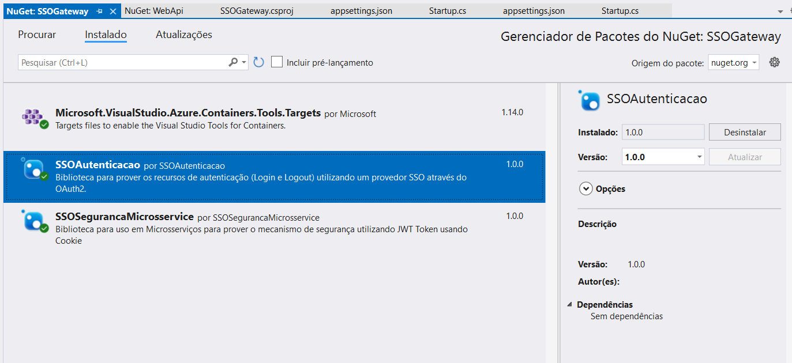
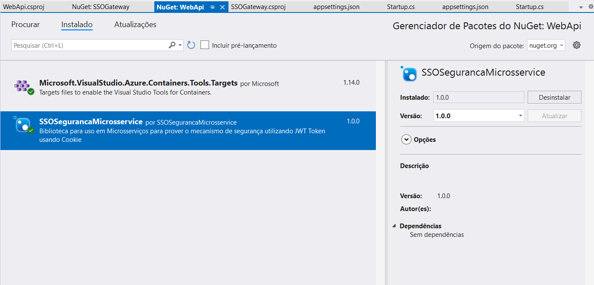

# Autenticação DotNet Core

Bibliotecas para prover autenticação SSO para aplicações DotNet Core.

Estas bibliotecas efetuam as configurações necessárias para que um projeto `WebApi` possa realizar a autenticação em um SSO como o Apereo CAS por exemplo.

<br/>
<br/>

## Composição da Solution

Esta solution é composta por 4 projetos, sendo as duas bibliotecas e dois projetos de exemplo na pasta `exemplo/` de uso destas bibliotecas, eles servem de exemplo de utilização e configuração:

* **SSOAutenticacao**: Esta lib é responsável por prover o fluxo de autenticação e comunicação com o SSO;
* **SSOSegurancaMicrosservice**: Esta lib é responsável pela configuração dos microsserviços para que trabalhem com o token gerado pela lib SSOAutenticação. Este token é mantido em um cookie com o nome `jwt-token`.

Agora os projetos de exemplo:
* **SSOGateway**: Projeto que faz o papel de um `Gateway`, contendo os endpoints de login e logout, bem como as configurações de acesso ao sistema SSO;
* **WebApi**: Projeto contendo apenas recuros REST que necessitam de um token com alguns perfis para serem utilizados

<br/>
<br/>

## Docker Redis

Na raiz do repositório há um arquivo docker-compose.yml que sobe todos o contêiner do REDIS para ser utilizado como teste. 

Para tanto, suba o container com o comando abaixo executado na pasta onde está o arquivo `docker-compose.yml`:

```
docker-compose up -d
```

> Importante destacar que não é necessário utilizar o REDIS. Esta informação é adicionada no momento da configuração da biblioteca.

<br/>
<br/>

## Configurações

Esta seção descreve como deve ser configurado cada tipo de microsserviço.

<br/>
<br/>

### **1 - Gateway para o SSO (Módulo de Segurança)**

Entende-se que algum dos microsserviços da solução deve fazer o papel de `Gateway`. A recomendação é que haja um, e apenas um, microsserviço que faça apenas este papel. Neste microsserviço é que são configuradas as propriedades para acesso ao SSO.

Este microsserviço é o responsável por receber a requisição `GET` para efetuar o login e redirecionar ao SSO, recebendo dele o retorno após autenticação com sucesso, gerar as roles e o token jwt que será encamindo para a aplicação client.

No exemplo deste repositório, quem faz este papel é o microsserviço **[SSOGateway](exemplo/SSOGateway)**

Abaixo as configurações necessárias para utilização deste recurso.

<br/>
<br/>

#### Dependência

Adicione neste microsserviço a dependência para a biblioteca:

1 - Utilizando a cli:

```
dotnet add package SSOAutenticacao
```

2 - ou abrir o arquivo `.csproj` e adicionar as referências manualmente:
```
<PackageReference Include="SSOAutenticacao" Version="1.0.0" />
```
3 - Ou adicionar a interface do Nuget Package



<br/>
<br/>

#### Arquivo de Propriedades do projeto

Após adicionar as dependências acima, agora é hora de configurar o arquivo `appsettings.json`.

No projeto `Gateway`, acrescente as seguintes propriedades:

```
"Security": {
  "OAuth2": {
    "ClientId": "MicroService1",
    "Secret": "LxmWVVNofRNAVHuQ",
    "UserAuthenticationUri": "/cas/login",
    "LoginSuccess": "http://localhost:4200/#/login-success",
    "UserAuthorizationUri": "https://sso.tst.xpto.com.br/cas/oauth2.0/authorize",
    "AccessTokenUri": "https://sso.tst.xpto.com.br/cas/oauth2.0/accessToken",
    "UserInfoUri": "https://sso.tst.xpto.com.br/cas/oauth2.0/profile",
    "LogoutUri": "https://sso.tst.xpto.com.br/cas/logout"
  },
  "Authentication": {
    "AppPrefix": "MicroService1",
    "Jwt": {
      "Secret": "fedaf7d8863b48e197b9287d492b708e",
      "MaxAge": 60
    }
  }
},
"RedisConnectionString": "localhost,abortConnect=false"
```

Definição dos atributos:

| Atributo | Descrição |
| ------ | ------ |
| Security:OAuth2:ClientId | Identificador única da aplicação que está registrado no SSO |
| Security:OAuth2:Secret | Chave de validação da aplicação cadastrada no SSO |
| Security:OAuth2:UserAuthenticationUri | Sufixo da URL do SSO responsável por fazer a autenticação, para onde a aplicação fará o redirecionamento com os parâmetros OAuth |
| Security:OAuth2:LoginSuccess | URL para onde será redirecionado após login com sucesso |
| Security:OAuth2:UserAuthorizationUri | URL do SSO para realizar a etapa de autorização do fluxo OAuth |
| Security:OAuth2:AccessTokenUri | URL do SSO para obtenção do token de acesso |
| Security:OAuth2:UserInfoUri | URL do SSO para obtenção do profile do usuário |
| Security:OAuth2:LogoutUri | URL do SSO para realização do logout |
| Security:Authentication:AppPrefix | Prefixo a ser adicionado à chave de registro das roles no Redis |
| Security:Authentication:Jwt:Secret | Chave para criptografar e descriptografar o token JWT |
| Security:Authentication:Jwt:MaxAge | Tempo em minutos de duração do token JWT |
| RedisConnectionString | URL de conexão com o Redis. Esta url só é necessária se for utilizado o Redis como cache para as roles. Atributo `UseRedis` do método `ConfigureAutenticacaoService(Configuration, UseRedis: true)` |

<br/>
<br/>

#### Configurações do projeto

Na classe `Startup.cs`, faça as seguinte configurações:

* Importe os namespaces:

```
using SSOAutenticacao.Autenticacao;
using SSOSegurancaMicrosservice.Autenticacao;
```

<br/>
<br/>

* Método ConfigureServices(IServiceCollection services) inclua:

```
public void ConfigureServices(IServiceCollection services)
{
  ...
  services.ConfigureAutenticacaoService(Configuration, true);
  ...
}
```
> O parâmetro `UseRedis`, no exemplo acima recebeu o valor `true`, indicando que as roles do usuário deverão ser armazenadas e obtidas do REDIS e com isso, não vão trafegar no token jwt para os clients.

<br/>
<br/>

* No método `Configure(IApplicationBuilder app, IWebHostEnvironment env)`, acrescente:

```
app.ConfigureSecurityApp();
...
app.UseAuthentication();
app.ConfigureSecurityCacheApp();
app.UseAuthorization();
...

```

> Atente para a ordem de inclusão destas linhas. A `ConfigureSecurityApp()` tem que ser a primeira
> linha do pipeline do aspnet e a `ConfigureSecurityCacheApp()` precisa estar entre a `UseAuthentication()`
> e `UseAuthorization()`, **nesta ordem**.

<br/>
<br/>

Exemplo completo:

```
public void Configure(IApplicationBuilder app, IWebHostEnvironment env)
{
    if (env.IsDevelopment())
    {
        app.UseDeveloperExceptionPage();
    }
    app.ConfigureSecurityApp();

    app.UseHttpsRedirection();

    app.UseRouting();

    app.UseAuthentication();
    app.ConfigureSecurityCacheApp();
    app.UseAuthorization();

    app.UseEndpoints(endpoints =>
    {
        endpoints.MapControllers();
    });
}
```

<br/>
<br/>

### **2 - WebAPi - Microsserviços**

Configuração dos microsserviços para uso de autenticação JWT.

No exemplo deste repositório, quem faz este papel é o microsserviço **[WebApi](exemplo/WebApi)**

Abaixo as configurações necessárias para utilização deste recurso.

<br/>
<br/>

#### Dependência

Adicione neste microsserviço a dependência para a biblioteca:

1 - Utilizando a cli:

```
dotnet add package SSOSegurancaMicrosservice
```

2 - ou abrir o arquivo `.csproj` e adicionar as referências manualmente:
```
<PackageReference Include="SSOSegurancaMicrosservice" Version="1.0.0" />
```
3 - Ou adicionar a interface do Nuget Package



<br/>
<br/>

#### Arquivo de Propriedades do projeto

Após adicionar as dependências acima, agora é hora de configurar o arquivo `appsettings.json`.

No projeto `Microsserviço`, acrescente as seguintes propriedades:

```
"Security": {
  "Authentication": {
    "AppPrefix": "MicroService1",
    "Jwt": {
      "Secret": "fedaf7d8863b48e197b9287d492b708e",
      "MaxAge": 60
    }
  }
},
"RedisConnectionString": "localhost,abortConnect=false"
```
> As definições dos atributos acima são as mesmas apresentadas anteriormente.

<br/>
<br/>

#### Configurações do projeto

Na classe `Startup.cs`, faça as seguinte configurações:

* Importe os namespaces:

```
using SSOSegurancaMicrosservice.Autenticacao;
```
<br/>
<br/>

* Método `ConfigureServices(IServiceCollection services)` inclua:

```
public void ConfigureServices(IServiceCollection services)
{
  ...
  services.ConfigureAutenticacaoJwt(Configuration, true);
  ...
}
```
> O parâmetro `UseRedis`, no exemplo acima recebeu o valor `true`, indicando que as roles do usuário deverão ser armazenadas e obtidas do REDIS e com isso, não vão trafegar no token jwt para os clients.

<br/>
<br/>

* No método `Configure(IApplicationBuilder app, IWebHostEnvironment env)`, acrescente:

```
app.ConfigureSecurityApp();
...
app.UseAuthentication();
app.ConfigureSecurityCacheApp();
app.UseAuthorization();
...

```

> Atente para a ordem de inclusão destas linhas. A `ConfigureSecurityApp()` tem que ser a primeira
> linha do pipeline do aspnet e a `ConfigureSecurityCacheApp()` precisa estar entre a `UseAuthentication()`
> e `UseAuthorization()`, **nesta ordem**.

<br/>
<br/>

Exemplo completo:

```
public void Configure(IApplicationBuilder app, IWebHostEnvironment env)
{
    if (env.IsDevelopment())
    {
        app.UseDeveloperExceptionPage();
    }
    app.ConfigureSecurityApp();

    app.UseHttpsRedirection();

    app.UseRouting();

    app.UseAuthentication();
    app.ConfigureSecurityCacheApp();
    app.UseAuthorization();

    app.UseEndpoints(endpoints =>
    {
        endpoints.MapControllers();
    });
}
```

<br/>
<br/>

## Aplicação client

Após configuração dos serviços de backend descritos nas seções anteriores, no front-end basta acessar a URL disponibilizada pelo módulo que faz o papel de `Gateway` para que seja redirecionado à tela de login do sso e, depois de logado, para a URL da aplicação client que deve ser configurada no atributo `Security:OAuth2:LoginSuccess` no arquivo `appSettings.json` do módulo `Gateway`.

<br/>

```
https://localhost:5001/api/sso/login
```

<br/>

ou 

<br/>

```
http://localhost:5000/api/sso/login
```
<br/>

> Estas URLs são configuráveis. Este exemplo acima é apenas uma demonstração de uso com base nos projetos de exemplo citados anteriormente.

<br/>

Para fazer o **logout**, basta chamar:

<br/>

```
https://localhost:5001/api/sso/logout
```

<br/>

ou 

<br/>

```
http://localhost:5000/api/sso/logout
```
<br/>


Após logar, para recuperar os dados do usuário logado, estas bibliotecas também disponibilizam o seguinte endpoint:

<br/>

```
http://localhost:5000/api/user/details
```
<br/>

ou

<br/>

```
https://localhost:5001/api/user/details
```
<br/>
